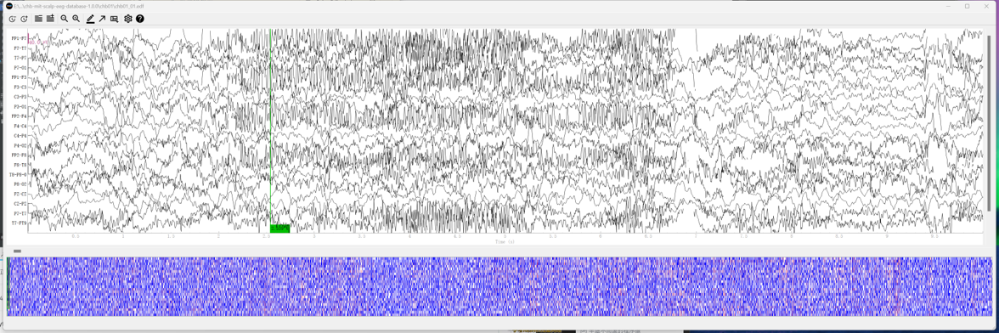
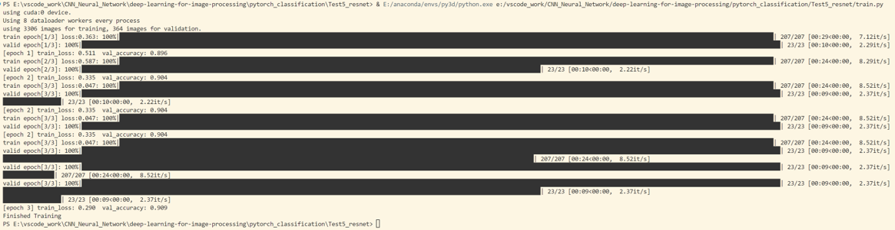

这两周除了忙了点奇奇怪怪的事情之外，还把这个blog弄好了。  
之后会把所有学到的东西写成笔记放上来的。  
（因为感觉如果不自己写一遍代码学完就会忘掉www）  
这是我重写的model文件，涵盖了**sequential队列**、**nn.module继承**、**forward前向传播**和**kaiming函数参数初始化**。  
>参考b站课程：<https://www.bilibili.com/video/BV1b7411T7DA>  

## model.py  
```python
import torch.nn as nn
import torch

class Luozi(nn.Module):
    def __init__(self,num_classes=256,init_weights=False):
        super(Luozi,self).__init__()
        self.features = nn.Sequential(
            nn.Conv2d(3, 10, kernel_size = 6, stride = 4, padding = 1),#3通道10个6*6卷积核，步长4补齐1
            #计算得，[3,1145,1145]会被转化为[10,286,286]
            #因为对于每一个卷积核，RGB都被合并为一个通道。
            nn.ReLU(),
            nn.MaxPool2d(kernel_size=3, stride=2, padding=1),#[10,143,143]
            nn.Conv2d(in_channels=10, out_channels=30, kernel_size=4, stride=1, padding=0),#[30,140,140]
            nn.ReLU(),
            nn.MaxPool2d(kernel_size=3, stride=2, padding=1),#[30,70,70]
            nn.Conv2d(in_channels=30, out_channels=90, kernel_size=8, stride=4, padding=0),#[90,8,8]
            nn.ReLU(),
            nn.MaxPool2d(kernel_size=2, stride=1)#[90,7,7]
        )
        self.classifier = nn.Sequential(
            nn.Dropout(p=0.5),
            nn.Linear(90*7*7,2048),
            nn.ReLU(),
            nn.Dropout(p=0.4),
            nn.Linear(2048,512),
            nn.ReLU(),
            nn.Linear(512,num_classes)
        )
        if init_weights == True:
            self._initialize_weights()
    def forward(self,x):
        x = self.features(x)
        x = torch.flatten(x,start_dim=1)
        x = self.classifier(x)
        return x
    def _initialize_weights(self):
        for m in self.modules():#调用继承自父类的.modules()方法，返回解包后的每一层
            if isinstance(m,nn.Conv2d):
                nn.init.kaiming_normal_(m.weight, mode='fan_out', nonlinearity= 'relu')
                #normal后面的_代表inplace=True
                if m.bias is not None:
                    nn.init.constant_(m.bias,0)
            elif isinstance(m,nn.Linear):
                nn.init.normal_(m.weight,0,0.01)
                nn.init.constant_(m.bias,0)
```
  
还装好了**mne**库，参考这个课程：<https://www.bilibili.com/video/BV1iR4y1W7Tz>  
  
下载并读取了**CUB-MIT数据集**，代码和截图如下：  
## mne_test.ipynb
```python
import mne

edf_file_path = 'E:/kaggle_dataset/chb-mit-scalp-eeg-database-1.0.0/chb01/chb01_01.edf'

raw = mne.io.read_raw_edf(edf_file_path, preload=True)
# 打印文件的基本信息
# print(raw.info)  # 显示通道、采样率等
# print(raw.ch_names)  # 显示所有通道名称
print('trying to visualize.')
# 可视化数据
raw.plot()
```

## 运行结果：
  
  
还跑了一遍Resnet的代码，4060跑的就是快（


## 下次更新的内容
1. pytorch3d安装经验  
2. 