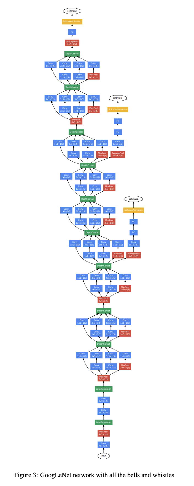

## 卷积的输入与输出
用于计算卷积后张量矩阵长宽的公式：

$$
{out}_{size} = \left({in}_{size} - F_{size} + 2P\right)/S + 1
$$

其中F代表卷积核大小，P是paddings补全，S是stride步长。  
## GoogLeNet
2014年谷歌提出的深度学习分类网络。特点是使用了***Inception多尺度卷积模块***和***辅助分类器***进行训练，分别可以解决***捕捉图像特征***和***梯度消失***的问题。现在并不是主流模型，但是它的轻便和其中的一些思想我觉得很有新意，因此记录。
### 总览
  
是不是很长？但是基本上就是多个inception的堆叠，中间夹了几个辅助分类器的输出。接下来是其中有意思的三个部分。
### 1.Inception多尺度卷积模块
  
inception结构具有**并行**和**稀疏**的特征。为什么要这么设计？  
1. 把输入的张量分别输入到四路当中并行计算，将最后的四个结果拼成一个张量。  

2. 1*1卷积核用于合并多通道图像，实现降维和减少参数的目的。  
   
3. 为什么还要接上3乘3和5乘5卷积核？这样可以捕捉局部和全局特征，最后进行拼接，可以综合考虑*不同尺度*上的像素之间的关系。这就是“稀疏”的思想：只考虑“对结果有影响”的部分，避免无用的计算。比如全连接层当中的一个神经元在逻辑上可能只与上一层的几个神经元有关联，但是每一次更新梯度都会反向传播上一层所有的神经元的梯度，因此我们需要”稀疏“来提高效率和准确度。  

4. 因为是最后进行拼接，所以每个通道的形状应该是一样的。这一点需要通过控制每一路的卷积核个数来保证。具体数据可以参考这个：  

### 2.辅助分类器
  
每一个辅助分类器的输出都是一个分类结果，换句话说就是“半成品”分类结果。  
  
多个辅助分类器的结果进行**加权求和**和反向传播，就成为了最终的分类结果。一般辅助分类器的权重较低，这里是0.3。  
  
这样做可以解决**梯度消失**的问题。一般来说，如果网络的结构太深，每一层反向传播之后由于精度不够，很容易使得梯度变为非常小的一个数导致消失。此即为梯度消失。  
  
但是如果使用辅助分类器，那么就可以使用它的损失对参数进行加权反向传播，通过保留较前部分的损失来缓解梯度消失的问题。这也就是为什么googlenet可以比其它的基础网络深一点而仍然有效。  
### 3.部分代码实现
在了解了googlenet是由多个inception结构和两个辅助分类器拼接而成之后，我们来看看这两个东西的代码。
> Talk is cheap , show me the code.

原代码来自第一篇深度学习提及的课程，代码太长所以先不手写了。我选了一些比较有意思的部分作学习。
#### model.py
```python
import torch.nn as nn
import torch
import torch.nn.functional as F


class GoogLeNet(nn.Module):
    #inception前面的网络部分，省略。

    def forward(self, x):
        #前向传播具体实现全省略，但这里有辅助分类器的输出。
        if self.training and self.aux_logits:    # eval model lose this layer
            aux1 = self.aux1(x)
        if self.training and self.aux_logits:    # eval model lose this layer
            aux2 = self.aux2(x)
        if self.training and self.aux_logits:   # eval model lose this layer
            return x, aux2, aux1
        return x

    def _initialize_weights(self):
        #初始化权重，省略。


class Inception(nn.Module):
    def __init__(self, in_channels, ch1x1, ch3x3red, ch3x3, ch5x5red, ch5x5, pool_proj):
        super(Inception, self).__init__()
        #这下面的四个branch就是inception的四路结构。
        self.branch1 = BasicConv2d(in_channels, ch1x1, kernel_size=1)

        self.branch2 = nn.Sequential(
            BasicConv2d(in_channels, ch3x3red, kernel_size=1),
            BasicConv2d(ch3x3red, ch3x3, kernel_size=3, padding=1)   # 保证输出大小等于输入大小
        )

        self.branch3 = nn.Sequential(
            BasicConv2d(in_channels, ch5x5red, kernel_size=1),
            BasicConv2d(ch5x5red, ch5x5, kernel_size=5, padding=2)   # 保证输出大小等于输入大小
        )

        self.branch4 = nn.Sequential(
            nn.MaxPool2d(kernel_size=3, stride=1, padding=1),
            BasicConv2d(in_channels, pool_proj, kernel_size=1)
        )

    def forward(self, x):
        branch1 = self.branch1(x)
        branch2 = self.branch2(x)
        branch3 = self.branch3(x)
        branch4 = self.branch4(x)

        outputs = [branch1, branch2, branch3, branch4]
        return torch.cat(outputs, 1)#pytorch中排列顺序是batch，channel，height，width，这里按照索引为1的通道channel合并，（其他维度都保持了一样的形状才能做到）。


class InceptionAux(nn.Module):
    #辅助分类器内部结构，省略。


class BasicConv2d(nn.Module):
    #这个函数将前向传播和卷积合在一块了。
    def __init__(self, in_channels, out_channels, **kwargs):
        super(BasicConv2d, self).__init__()
        self.conv = nn.Conv2d(in_channels, out_channels, **kwargs)
        self.relu = nn.ReLU(inplace=True)

    def forward(self, x):
        x = self.conv(x)
        x = self.relu(x)
        return x
```

### train.py
```python
def main():

    data_transform = {
        "train": transforms.Compose([transforms.RandomResizedCrop(224),
                                     transforms.RandomHorizontalFlip(),
                                     transforms.ToTensor(),
                                     transforms.Normalize((0.5, 0.5, 0.5), (0.5, 0.5, 0.5))]),
        "val": transforms.Compose([transforms.Resize((224, 224)),
                                   transforms.ToTensor(),
                                   transforms.Normalize((0.5, 0.5, 0.5), (0.5, 0.5, 0.5))])}

        #此处省略一万字
    for epoch in range(epochs):
        # train
        net.train()#切换函数行为，有的函数（比如dropout）在train和eval的时候行为不同，因此需要切换。
        running_loss = 0.0
        train_bar = tqdm(train_loader, file=sys.stdout)
        for step, data in enumerate(train_bar):
            images, labels = data
            optimizer.zero_grad()#清空梯度，防止累加。
            logits, aux_logits2, aux_logits1 = net(images.to(device))#前向传播，返回三个结果。
            loss0 = loss_function(logits, labels.to(device))
            loss1 = loss_function(aux_logits1, labels.to(device))
            loss2 = loss_function(aux_logits2, labels.to(device))#计算辅助分类器输出和标签张量之间的损失，.to(device)是将标签移动到计算设备上。
            loss = loss0 + loss1 * 0.3 + loss2 * 0.3#辅助分类器损失加权求和。
            loss.backward()#反向传播
            optimizer.step()#执行一次参数更新

    #往下省略一万字
```

<script src="https://giscus.app/client.js"
        data-repo="Le1zyCatt/le1zycatt.github.io"
        data-repo-id="R_kgDOORaJaw"
        data-category="Announcements"
        data-category-id="DIC_kwDOORaJa84Co8xd"
        data-mapping="pathname"
        data-strict="0"
        data-reactions-enabled="1"
        data-emit-metadata="0"
        data-input-position="bottom"
        data-theme="preferred_color_scheme"
        data-lang="zh-CN"
        crossorigin="anonymous"
        async>
</script>
