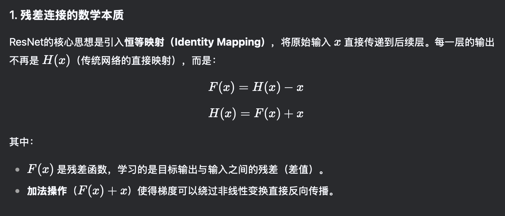
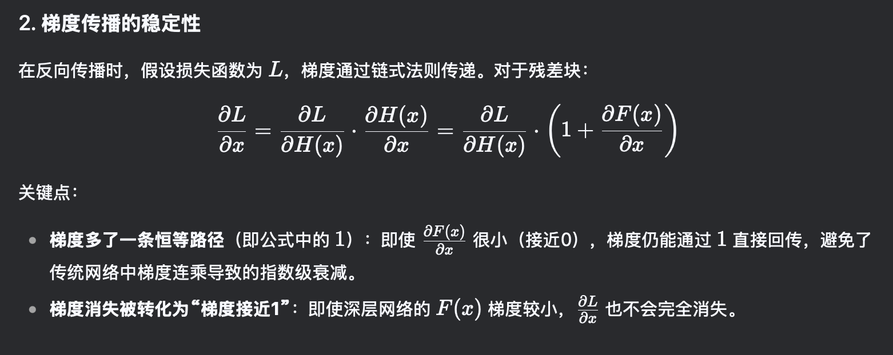

# Resnet创新点
## 1.残差连接（residual模块）
resnet也有很多参数版本，我们先看看这个18层的。  

可以看到小的res模块组成不同的conv结构，再堆叠起来成为Resnet。  
  
图上的实线残差与虚线残差有什么不同？实线直接加和，虚线残差对输入x还要进行形状上的调整（1*1卷积）以符合y的形状。  
  
简单来说，对于每个residual模块，将输入的x矩阵与输出的y矩阵相加，就得到了该模块的输出。（所以还要保持x与y的形状相同）  
  
该结构通过降维+升维减少参数量，且可以显著降低梯度消失和爆炸的影响，可以训练深至1000层的网络。这就是“残差连接”。  

  
是不是有点懵？大部分搜到的笔记都是写这个，谁特么看得懂...  
所以让我们看看下面这张图。
  
这里就很清晰了。最后面括号里出现的1是被加到res模块输出上的$$x$$对$$x$$的偏导，所以使得这个梯度很难出现接近0的数字。  
  
而后面的bn和relu激活更是缓解了梯度爆炸的问题。  
## 2.批量归一化（batch normalization）
batch normalization是将**张量的每一个通道的矩阵**都进行标准化（这里的矩阵不一定是一个，如果输入数据是一个视频的话就可以是很多个，但它们同属于一个通道，矩阵的个数就是batch_size），然后再**线性变换**成为最终的值。  
  
这里的线性变化参数也是通过学习不断调整的。默认$$γ$$=1，$$ß$$=0。  
  
bn用于卷积层，一般放在卷积层之后，激活层之前。而dropout则用于全连接层。  
  
注意：在使用bn方法后，无需使用bias。因为bn方法自带beta偏置。  
## 3.瓶颈结构：降维+升维（bottleneck block）
不是Resnet的独有，这样降维再升维的思想在这里由瓶颈结构体现，在transformer架构中参与减少多头注意力计算量的任务。  
  
通过将输入的矩阵通过控制卷积核个数先降维再升维，可以在保持输入输出矩阵形状不变的同时减少参数量，甚至在某些情况下还能提升准确率。为什么？原因如下：  
1. 过滤冗余信息/噪声。
2. 降维后接非线性激活函数增强表征能力。
3. 抑制过拟合。
经验：降维后通道数是原来的1/4比较好。过度降维会导致信息丢失。
## 4.其它概念
迁移学习：复制预训练的参数，其实就是拼好模型。  
常用迁移学习方法：
1. 载入权重后训练所有参数。
2. 训练最后几层参数。
3. 最后加上全连接层，仅训练添加的部分。  

# 改进版Resnext
## 1.组卷积
Resnext是作者提出的新论文，其中就只有组卷积的概念比较重要。  
将输入张量分为$$g$$组（这就是cardinality基数的概念），每一组使用$$c$$个卷积核进行卷积，最后再按照通道拼接。  
这样可以减少$$g$$倍卷积的参数量和计算量，还可以并行。问题就是通道组之间信息不共享。  
注意：设计时需保证通道数可以被组数整除。  

# 部分代码实现
## 1.model.py
```python
    def forward(self, x):
        identity = x
        if self.downsample is not None:
            identity = self.downsample(x)

        out = self.conv1(x)
        out = self.bn1(out)
        out = self.relu(out)

        out = self.conv2(out)
        out = self.bn2(out)

        out += identity #x+y
        out = self.relu(out)

        return out
```
其他部分其实都差不多。示例代码里还有加载预训练参数的部分（迁移学习），下次可以试试。

<script src="https://giscus.app/client.js"
        data-repo="Le1zyCatt/le1zycatt.github.io"
        data-repo-id="R_kgDOORaJaw"
        data-category="Announcements"
        data-category-id="DIC_kwDOORaJa84Co8xd"
        data-mapping="pathname"
        data-strict="0"
        data-reactions-enabled="1"
        data-emit-metadata="0"
        data-input-position="bottom"
        data-theme="preferred_color_scheme"
        data-lang="zh-CN"
        crossorigin="anonymous"
        async>
</script>
