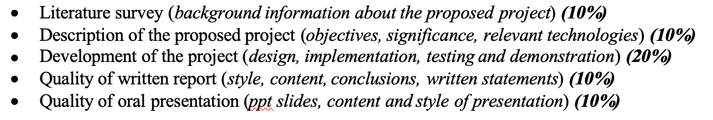

# 流程
1. 安装ncatbot库，配置环境。
2. 修改main.py，配置账号、api和提示词，添加功能。
3. 运行脚本并登陆qq号。

其实很简单。主要工作量在于main.py的编写。怎么体现我们的工作量？  

大部分代码是有模板/复制过来的。我自己照着加了一个调api返回随机*图的功能。可以介绍一下main的架构、功能，且选几个功能讲代码。  

选题名字是smart chatbot，关键在于smart，但我是调deepseek的api，模型本身的smart不是我们做的，没法讲。  

所以，主要是讲讲***消息处理机制、上下文机制、提示词技巧、async异步机制、main架构和小功能***。  

# 要点
1. 整个main基本分为@bot.group_event()和@bot.private_event()两个部分，它们分别处理群消息和私信。两者的行为相似。这里可以写一些针对特定消息的回复。
2. 调api首先得去看api的文档，不过大部分都可以rq.get()和json解析。requests库的rq.get()用于获取api传回的信息（一般是json格式），.json()用于解析。
3. 接收到用户发的消息后，由进程转发给ds，再按照回复逻辑将ds生成的消息处理、切分并回复。因为ds生成的是markdown格式，所以使用remove_markdown函数处理后再回复。
4. **412行开始是群消息的上下文机制（私信部分也有，755行），逻辑很简单，就是把之前的消息历史存储进json文件，每次都发给ds。但是这样会导致文字越来越多，ds出现幻觉不能好好说话。所以这里完全可以优化一下。**
5. 调用ds是用的openai库，和大部分ai调用一样，第21行。
6. 提示词写在premise里，42行。这里大有可为，技巧很多，你们可以研究研究，但我是乱写的（
7. async异步机制参考这篇文章：[一文读懂Python async/await异步编程](https://zhuanlan.zhihu.com/p/698683843)，main里的大部分函数（除了后来加上的）都是使用async定义。async关键字可以让进程同时执行（但还是单线程），适用于这种chatbot要同时处理多个用户消息的情况，可以当作重点写。
8. 我是部署在ubuntu服务器上，部署的过程应该也可以写上去。
9. 各种小功能自己看，基本上是调用api和做一些特定回复/换头像什么的。
  
# 要求
  
1. 背景10%
2. 目标+意义+技术10%
3. 设计+实操+测试+演示20%
4. 风格+内容+总结+书面撰写10%
5. ppt+汇报10%
  
group project的ddl是6.14，这周你们先看看代码学习一下（我自己也还在看www）。晚点计划把这个传到github上，想自己跑一遍的可以去pull，也可以直接找我。

