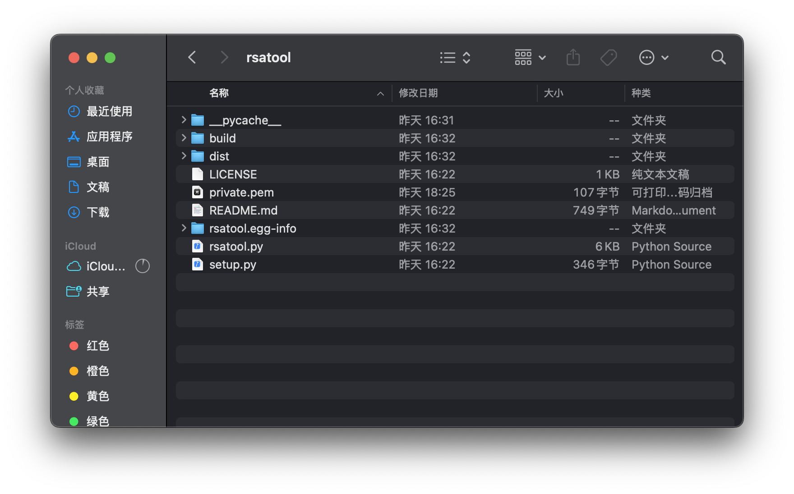
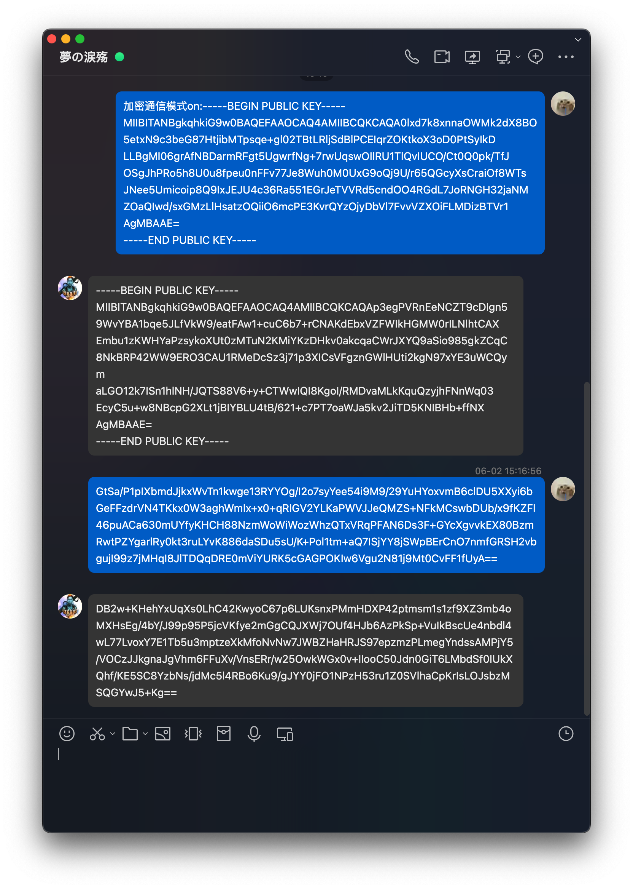
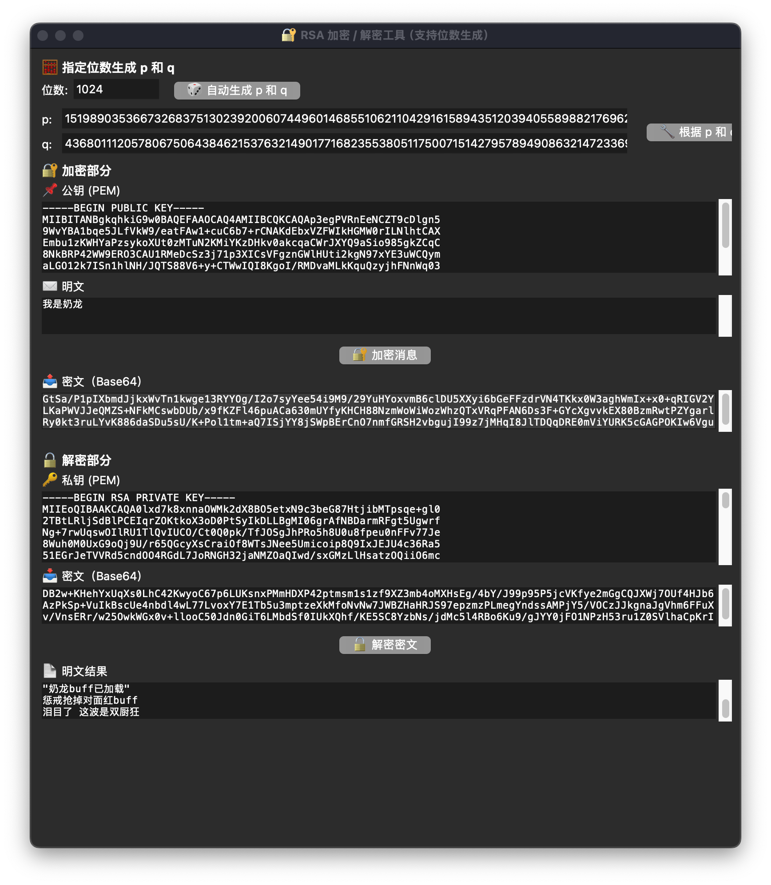

关于更多的chatbot细节，可以参阅：[ncatbot聊天机器人](https://le1zycatt.github.io/posts/ncatbot_process/)
# 1.chatbot部署与持久化
在linux系统中，一般使用venv作为环境管理工具，很方便。  
新建一个目录，然后在该目录中使用venv命令新建环境，则环境就会被安装在该目录中。每次需要启动环境时的命令如下：  
```bash
cd path
source bin/activate
```
使用source命令激活了该环境，下一步激活screen。  
```bash
sudo apt-get install screen #安装screen
screen -S name #name替换为想要的screen进程名字
screen -ls #查看现有的screen
```
然后我们可以运行脚本。
```bash
cd path
python3 main1.py
```
  
# 2.RSA加密的流程
让我们复习一下rsa加密的流程：  
1. 通信双方各自生成公钥（n,e）和私钥（n,d）
2. 通过可信渠道交换各自的公钥。
3. 通信时使用对方的公钥加密，收到消息使用自己的私钥解密。  

rsa的数学原理和证明在这里：[rsa及其数学证明](https://le1zycatt.github.io/posts/rsa_note/)

我设想的流程是这样的：如果用户提出加密通信请求（并且附上了公钥），那么生成并发送服务器端公钥，用户可以据此加密信息。在发送消息时，用户先在本地使用服务器端的公钥进行加密，然后作为消息发送，服务器端可以使用私钥进行解密。反之亦然。下面是流程图：    
```lua
       +--------------+                                    +--------------+
       |    用户       |                                    |     服务器    |
       +--------------+                                    +--------------+
             |                                                    |
             | /encrypt my_public_key                             |
             |--------------------------------------------------->|
             |                                                    |
             |        保存用户公钥 / 生成服务端密钥对                  |
             |<---------------------------------------------------|
             |               返回服务端公钥                         |
             |                                                    |
       用户本地生成密钥对                                    服务器保存用户状态
             |                                                    |
             |   用户用服务端公钥加密消息，发送密文                     |
             |--------------------------------------------------->|
             |   解密消息，正常处理，服务器回复后加密内容                |
             |<---------------------------------------------------|
             |   用户用自己私钥解密，得到服务器的消息                   |

```
# 3.实现加密通信
### 1. 安装依赖  
使用了https://github.com/ius/rsatool项目的一部份代码。   
  
在我们的项目中将只会使用rsatools.py实现使用大素数生成密钥的逻辑。  
创建个环境，安装一下依赖：
```zsh
cd path
conda create -n rsa python=3.9
conda activate rsa
python setup.py install #会按照setup.py安装依赖
pip install pyasn1 gmpy2 cryptography #或者手动安装依赖
```
  
### 2. 明确整体流程  
#### 步骤  
服务器端：  
```bash
生成p、q。  
根据p、q生成密钥对并保存在private.pem当中。  
从私钥文件中读取公钥，并保存在public.pem当中。  
将用户公钥、服务器端密钥对存储在f"./keys/{user_id}.json"文件中。  
删除pem文件。  
发送公钥，等待用户发送密文。  
使用服务器端私钥对密文进行解密，将解密后的信息送入api。  
将api回复的信息使用用户公钥进行加密，发送密文。  
```
用户端：  
```bash
使用rsa_gui_tool生成p、q
生成密钥对
将公钥发送
接受服务器端公钥，据此加密信息
发送密文
```

#### 补充说明

1. 裸rsa存在隐患，即相同的明文会生成相同的密文，可以被多种手段破解。因此需要引入随机的因素，OAEP就是目前最主流最安全的填充方法。虽然这是一个可逆的过程，但是可以**防止确定性加密攻击**和**增强抗选择性密文攻击能力**。  
2. 全程使用utf-8编码，OAEP填充的参数mgf是MGF1(SHA-256)，主哈希是SHA-256。说是哈希算法保持一致比较常见。mgf是一个伪随机哈希函数，根据它的哈希算法和要求的长度参数生成指定长度的伪随机序列。  
3. 2048位、1024位，这里的位指的是二进制位，十进制下大概有309和617位。  
4. 使用rsa加密后，密文还会经过**base64**处理，据说可以压缩长度，写程序的时候不要忘记。  

### 3.代码  
1. 整个main里和消息回复有关的部分分为@bot.group_event()和@bot.private_event()两个部分，通过全局布尔变量encrypt控制消息是否加密解密。需要同时对它们进行修改。在这两个修饰器函数内，记得都要写上global。其实应该对不同的消息类型和用户/群组id分别设置一个encrypt变量，但先这样吧。  
2. 与加密部分相关的逻辑，在main_short.py（就是删除了大部分不相关功能的文件，用于修改代码）里可以很快找到。对于group和private两个部分，开启加密通信的逻辑和消息解密发送给api的逻辑是分开写的，因此一共有**四个部分**。如果要修改记得同时修改这四个部分。  
3. 代码都放在这里了：[ncatbot_encrypt](https://github.com/Le1zyCatt/encrypt_ncatbot)。
4. rsaencrypt.py依赖于rsatools.py，在main1.py里引用了rsaencrypt，用于实现加密解密。
5. OAEP的实现使用了cryptography的高级接口，几行就搞定。每次加密的密文是不一样的。

### 4.效果  


  

<script src="https://giscus.app/client.js"
        data-repo="Le1zyCatt/le1zycatt.github.io"
        data-repo-id="R_kgDOORaJaw"
        data-category="Announcements"
        data-category-id="DIC_kwDOORaJa84Co8xd"
        data-mapping="pathname"
        data-strict="0"
        data-reactions-enabled="1"
        data-emit-metadata="0"
        data-input-position="bottom"
        data-theme="preferred_color_scheme"
        data-lang="zh-CN"
        crossorigin="anonymous"
        async>
</script>
