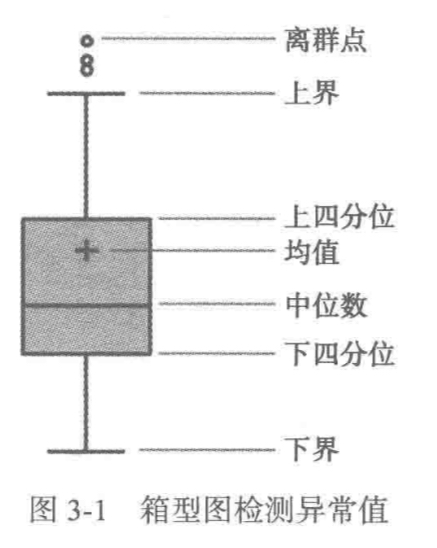
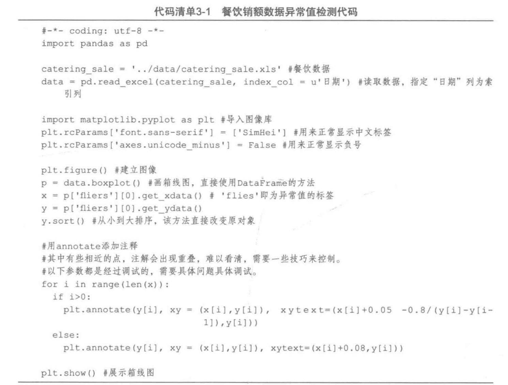
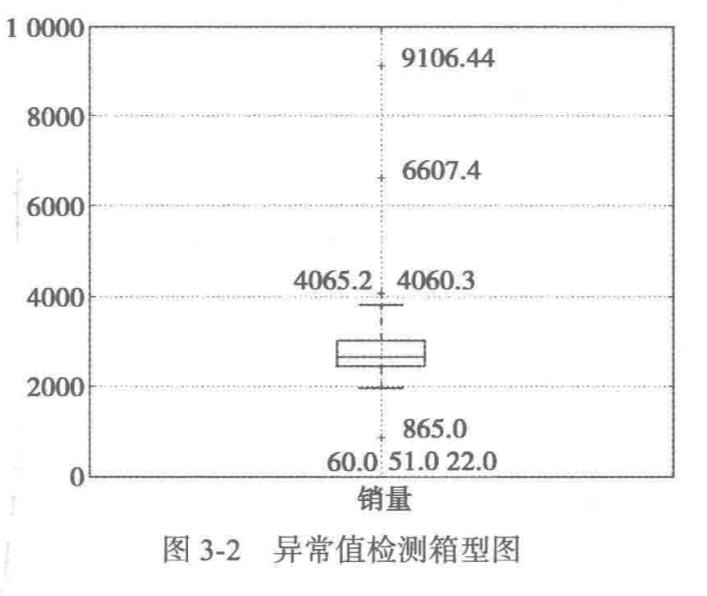
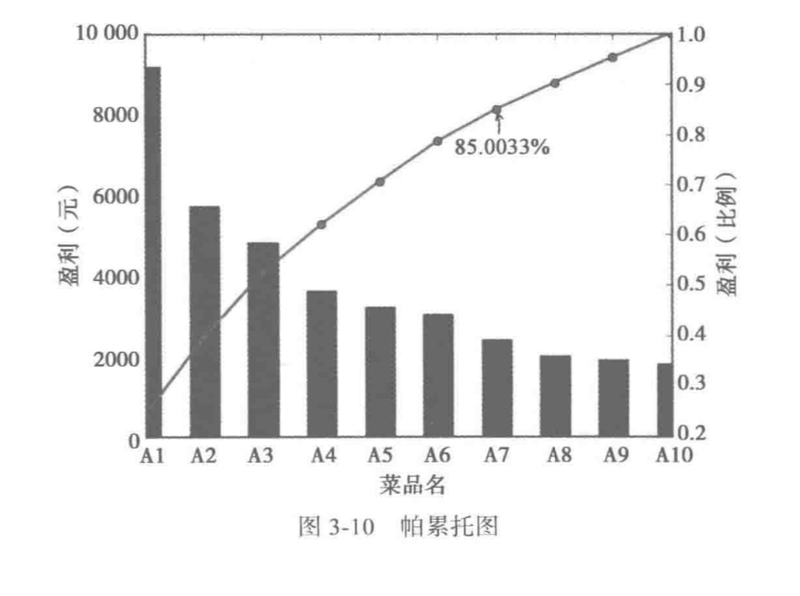

# 1.数据质量分析
目标：检查脏数据  
脏数据包括如下内容：  
1. 缺失值
2. 重复值
3. 不一致的值
4. 重复数据及含有特殊符号的数据
5. 异常值
  
## 1️⃣缺失值处理
删除/插值补值/不处理  
## 2️⃣异常值处理
### 一、统计量描述性分析
最大值/最小值/中位数/众数/平均数  
### 二、3sigma原则
对于服从正态分布的数据，数据点在3倍标准差之外的概率小于0.003。  
### 三、箱型图
  
比较直观，可以看到离群点，据此剔除不合理的值。  
```python
import pandas as pd
data = pd.read_excel(data_path, index_col = u'日期') #指定日期列为索引列
data.describe() #显示分析结果，有非空值数、平均数、标准差、最大最小值、四分位数等，很方便
```
在describe()之后，可以绘制箱型图：  
  
  
这里的9106.44和6607.4就是需要剔除的异常值。  
# 2.数据特征分析
## 1️⃣分布分析
### 一、定量数据的分布分析
求极差➡️决定组距和分组➡️绘制频率分布直方图
### 二、定性数据的分布分析
一般绘制饼状图/直方图
## 2️⃣对比分析
是将两个相互联系的指标进行比较的分析。此处简略。
## 3️⃣统计量分析
主要分为**集中趋势**和**离中趋势**。前者包括平均数、中位数、众数，后者包括极差、标准差、变异系数（标准差除以均值）、四分位数间距等。
## 4️⃣周期性分析
绘制出以时间为横轴的图像，观察周期性。周末和周中的区别之类的。LSTM、RNN等模型比较适合。
## 5️⃣贡献度分析
这个比较新奇，就是绘制帕累托图。帕累托图(基于20/80定律)就是累积图像，例如：  
  
定律认为，20%的产品创造了80%的利润，也就是说当需要做抉择的时候，优先关注创造了80%利润或者前20%的产品。代码略过，可以使用.cumsum()函数绘制。  
## 6️⃣相关性分析（重点）
### 一、绘制散点图矩阵
画出多个变量之间的散点图。  
### 二、计算相关系数（重点）
pearson相关系数、spearman秩相关系数。  
  
如果两个变量具有严格单调的函数关系，则它们是完全spearman相关的。但是pearson则要求必须是线性关系。  
  
如果变量是正态分布的，则两种相关系数效率上等价；如果是连续的测量数据，则pearman相关系数更适合。  
  
**计算完相关系数后还需要做假设检验**（t检验方法）。  
  
相关系数的平方就是**判定系数**。  
## 7️⃣一些统计作图函数
大部分都是常用的，没见过的就是***误差条形图***，应该是绘制数据相对于均值的误差范围，和箱型图有相似之处。我觉得箱型图更好。  
  
# 3.数据预处理
## 1️⃣数据清洗
目的：  
1. 删除无关数据、重复数据
2. 平滑噪声数据
3. 筛选掉无关数据
4. 处理缺失值、异常值  

### 一、缺失值处理
共有三种处理方式：  
1. 删除记录
2. 数据插补
3. 不处理


<script src="https://giscus.app/client.js"
        data-repo="Le1zyCatt/le1zycatt.github.io"
        data-repo-id="R_kgDOORaJaw"
        data-category="Announcements"
        data-category-id="DIC_kwDOORaJa84Co8xd"
        data-mapping="pathname"
        data-strict="0"
        data-reactions-enabled="1"
        data-emit-metadata="0"
        data-input-position="bottom"
        data-theme="preferred_color_scheme"
        data-lang="zh-CN"
        crossorigin="anonymous"
        async>
</script>
