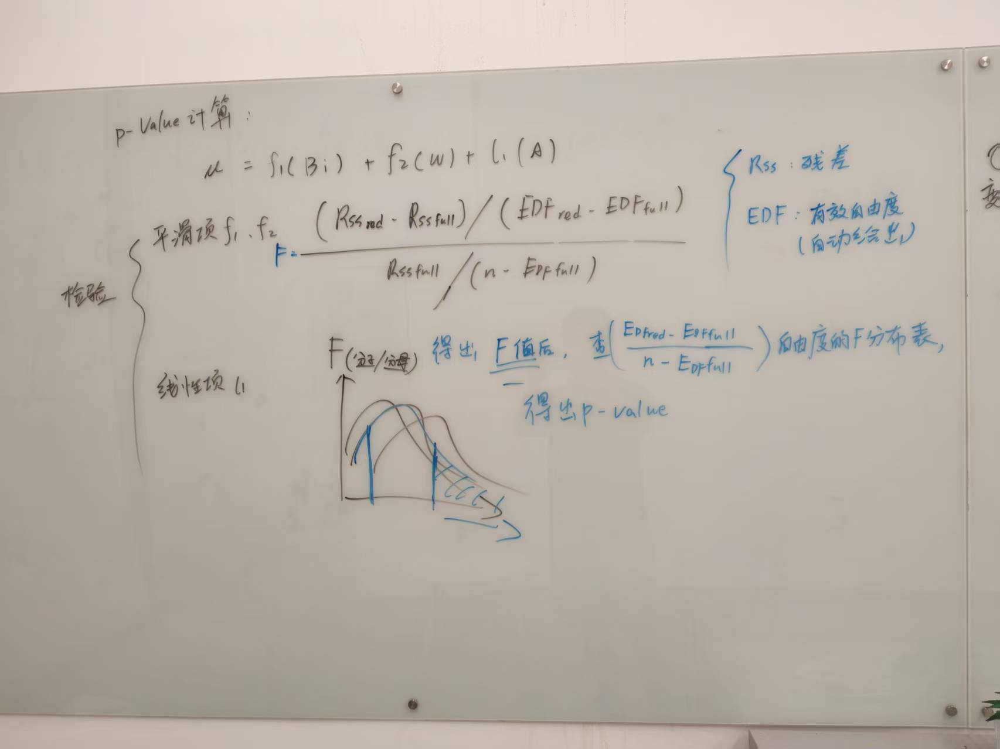
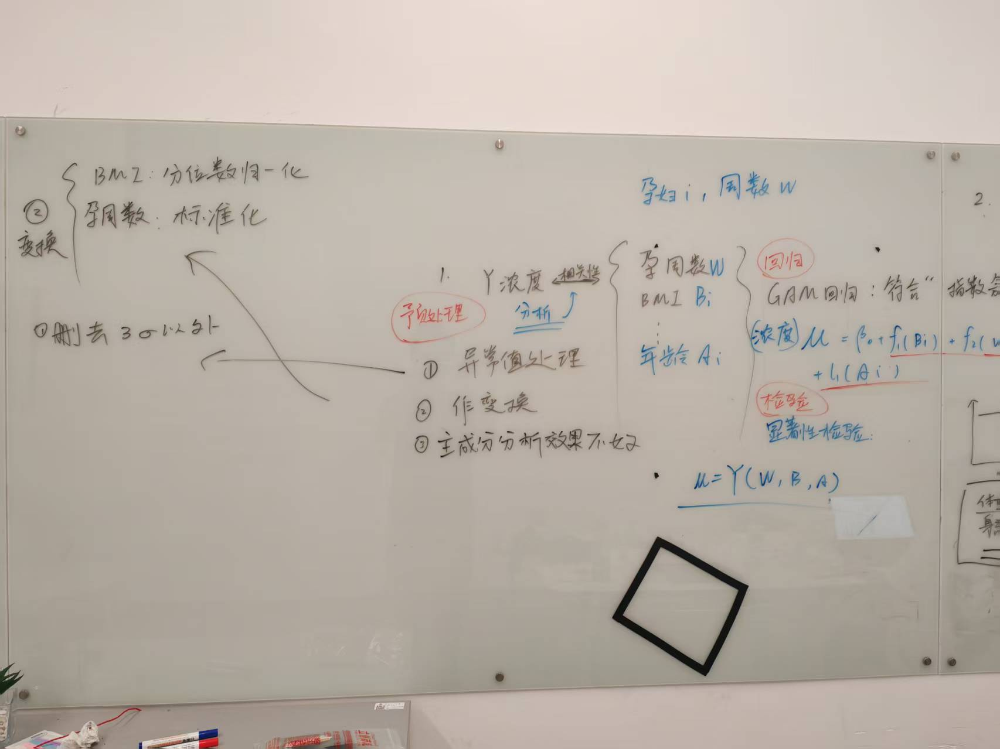
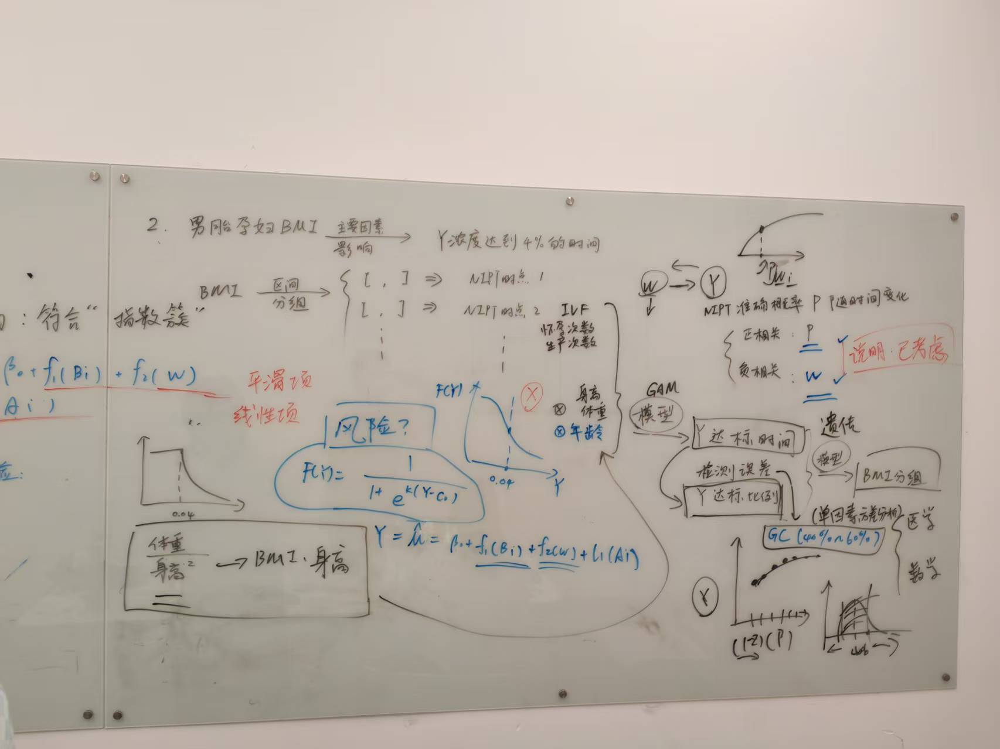

## 题目
<iframe
  src="../../assets/lib/C题.pdf"
  width="100%"
  height="900px"
  style="border:1px solid #48ef7a; border-radius:8px;">
</iframe>

## 思路
抽象一下：我们需要分析的是**“相关性”**以及原始数据和结果（一个数字，代表第几天）的关系。  
有了！一个（非）线性回归问题——先把条件和目标写成数学表达式，然后加入显著性检验和遗传算法求解，再加一点缝缝补补就行了。  
所以，我们就有了以下思路（从左至右排列）：  




## 论文
<iframe
  src="../../assets/lib/论文v3.pdf"
  width="100%"
  height="900px"
  style="border:1px solid #48ef7a; border-radius:8px;">
</iframe>
 
## 代码
### 第一题
<iframe src="../../assets/lib/1数据预处理及绘图.html" width="100%" height="600px" frameborder="0"></iframe>  

### 第二题

```python

import pandas as pd
import numpy as np
from sklearn.preprocessing import StandardScaler
from pygam import GAM, s, te, l
import matplotlib.pyplot as plt
import warnings
import random

warnings.filterwarnings("ignore")

# 1. 数据预处理与模型训练


# 设置中文显示
plt.rcParams['font.sans-serif'] = ['SimHei']
plt.rcParams['axes.unicode_minus'] = False

# 加载数据
try:
    df = pd.read_csv('附件_processed.csv', encoding='gbk')
except FileNotFoundError:
    print("Error: '附件_processed.csv' not found. Please check file path.")
    exit()
# 数据清洗与筛选
num_cols = df.select_dtypes(include=[np.number]).columns.tolist()

# 需要排除的列
exclude_cols = ['身高', '体重', '年龄', '孕妇BMI']

# 实际参与筛选的数值型列
num_cols = [col for col in num_cols if col not in exclude_cols]

# 逐列筛选
for col in num_cols:
    mean = df[col].mean()
    std = df[col].std()
    df = df[(df[col] >= mean - 3 * std) & (df[col] <= mean + 3 * std)]

df = df[df['Y染色体浓度'] <= 0.20].copy()
df = df[df['原始读段数'] >= 3000000].copy()
df = df.dropna().reset_index(drop=True)

n = len(df)
epsilon = (np.log(n - 1) + 0.5) / n
df['y_it'] = df['Y染色体浓度'].clip(epsilon, 1 - epsilon)

# 孕周标准化
scaler_g = StandardScaler()
df['g_it_std'] = scaler_g.fit_transform(df[['检测孕周']])

# BMI 分位数归一化：保存用于排名的 Series
bmi_for_rank = df['孕妇BMI'].copy()
df['b_i_norm'] = bmi_for_rank.rank(pct=True)

# 提取用于 GAM 训练的特征和标签
X_smooth = df[['g_it_std', 'b_i_norm']]
X_linear = df[['年龄']].astype(float)
X = X_smooth.join(X_linear)
y = df['y_it']

# 拟合 GAM 模型
gam = GAM(
    s(0) + s(1) + te(0, 1) + l(2),
    distribution='gamma',
    link='log'
).fit(X, y)

print("GAM 模型已成功拟合。")


# 去掉同一个孕妇的重复记录，只保留第一次
df = df.drop_duplicates(subset=['孕妇代码'], keep='first')

# 1. GA 参数

MAX_G = 6
MIN_G = 4
GROUP_PENALTY = -0.2
POP_SIZE = 50
N_GEN = 100
MUT_RATE = 0.7
CROSS_RATE = 0.7
score_k=0.15
#BMI_min, BMI_max = df['孕妇BMI'].min(), df['孕妇BMI'].max()
BMI_min, BMI_max = 26, 47
weeks_available = np.arange(14, 32)
N = df.shape[0]


# 2. BMI 分组函数
def assign_group(bmi_array, cuts):
    return np.searchsorted(cuts, bmi_array)

# 3. 初始化种群
def init_population():
    population = []
    for _ in range(POP_SIZE):
        while True:
            G_var = np.random.randint(MIN_G, MAX_G+1)
            # 生成严格递增的 cut
            cuts = np.sort(np.random.uniform(BMI_min, BMI_max - 3*(G_var-1), G_var-1))
            cuts = cuts + np.arange(G_var-1)*3  # 保证最小间距为3
            if np.all(cuts[1:] - cuts[:-1] >= 3):
                week_assign = np.random.choice(weeks_available, G_var)
                week_assign[0] = 14         # 第一周固定为 12
                population.append((cuts, week_assign))
                break
    return population

# 4. 批量预测函数
def predict_y_batch(gest_weeks, bmis, ages, gam, scaler_g, bmi_for_rank):
    gest_weeks = np.array(gest_weeks)
    g_it_std = scaler_g.transform(gest_weeks.reshape(-1,1)).flatten()

    bmis = np.array(bmis)
    combined_bmi = pd.concat([bmi_for_rank, pd.Series(bmis)])
    b_i_norm_all = combined_bmi.rank(pct=True).iloc[-len(bmis):].values

    X_pred = pd.DataFrame({
        "g_it_std": g_it_std,
        "b_i_norm": b_i_norm_all,
        "年龄": ages
    })

    # 🔹 预测值整体
    y_preds = gam.predict(X_pred)

    # 添加高斯噪声
    noise = np.random.normal(loc=0, scale=0.002, size=y_preds.shape)
    y_preds = y_preds + noise

    # 🔹 假阴性概率修改为分段指数衰减
    fn_probs = np.ones_like(y_preds)
    mask = y_preds > 0.04
    fn_probs[mask] = np.exp(-100 * (y_preds[mask] - 0.04))

    return y_preds, fn_probs

# 5. GA 适应度函数
def risk_score(weeks):
    """
    将孕周分为三档：
    - 早期 <=12 周: 基础分 1
    - 中期 13-27 周: 基础分 2
    - 晚期 >=28 周: 基础分 3
    并且在每个阶段随孕周增长增加小幅抬升
    """
    weeks = np.array(weeks)
    score = np.zeros_like(weeks, dtype=float)

    # 早期
    mask_early = weeks <= 12
    score[mask_early] = 1 + 0.05 * weeks[mask_early]  # 小幅抬升

    # 中期
    mask_mid = (weeks >= 13) & (weeks <= 27)
    score[mask_mid] = 2 + 0.02 * (weeks[mask_mid] - 13)  # 小幅抬升

    # 晚期
    mask_late = weeks >= 28
    score[mask_late] = 3 + 0.01 * (weeks[mask_late] - 28)  # 小幅抬升

    return score
def fitness(cuts, group_week_assign, df, gam, scaler_g, bmi_for_rank,score_k=0.4):
    """
    GA 适应度函数：在原有基础上增加 BMI 区间惩罚
    """
    bmis = df['孕妇BMI'].values
    ages = df['年龄'].values

    # 每个孕妇所属组
    groups = np.array([assign_group(bmi, cuts) for bmi in bmis])

    # 每个孕妇对应的检测周
    check_weeks = np.array([group_week_assign[g] for g in groups])

    # 批量预测 Y 浓度和假阴性概率
    _, fn_probs = predict_y_batch(check_weeks, bmis, ages, gam, scaler_g, bmi_for_rank)

    # 总假阴性风险
    total_risk = np.sum(fn_probs)

    # 检测周评分
    #week_score = np.where(check_weeks <= 12, 1, np.where(check_weeks <= 27, 1.5, 5))
    week_score = risk_score(check_weeks)
    total_score = np.sum(week_score)

    # BMI 区间惩罚
    cut_diffs = np.diff(np.concatenate(([BMI_min], cuts, [BMI_max])))
    small_interval_penalty = np.sum(cut_diffs < 3) * 100  # 区间小于3加惩罚

    G_var = len(cuts) + 1

    # 最终目标函数
    obj = 10 * total_risk + score_k * total_score + GROUP_PENALTY * G_var + small_interval_penalty

    return obj

# 6. 变异与交叉操作
def mutate(indiv):
    cuts, week_assign = indiv
    cuts = cuts.copy()
    week_assign = week_assign.copy()

    for i in range(len(cuts)):
        if np.random.rand() < MUT_RATE:
            cuts[i] += np.random.uniform(-1, 1)
    cuts = np.clip(cuts, BMI_min, BMI_max)
    cuts = np.sort(cuts)
    # 修正最小间距
    for i in range(1, len(cuts)):
        if cuts[i] - cuts[i-1] < 3:
            cuts[i] = cuts[i-1] + 3
    # 最后一组不超过 BMI_max
    if cuts[-1] > BMI_max:
        cuts[-1] = BMI_max

    for i in range(len(week_assign)):
        if np.random.rand() < MUT_RATE:
            week_assign[i] = np.random.choice(weeks_available)
    return (cuts, week_assign)


def crossover(parent1, parent2):
    """
    优化：允许不同组数的个体进行交叉。
    """
    cuts1, weeks1 = parent1['cuts'], parent1['weeks']
    cuts2, weeks2 = parent2['cuts'], parent2['weeks']

    # 将两个父代的 cuts 和 weeks 合并，然后重新排序和选择
    # 合并两个父代的分割点，并去重，得到一个更全面的分割点集合
    all_cuts = np.unique(np.concatenate([cuts1, cuts2]))

    # 随机确定子代的组数，允许在 MIN_G-1 到 MAX_G-1 之间随机选择 cut 的数量
    # 注意：这里的 new_cuts_size 是 cut 的数量，实际组数是 new_cuts_size + 1
    new_cuts_size = np.random.randint(MIN_G - 1, MAX_G)

    # 从合并后的所有分割点中，随机选择 new_cuts_size 个作为子代的分割点
    if len(all_cuts) > new_cuts_size:
        new_cuts = np.sort(np.random.choice(all_cuts, new_cuts_size, replace=False))
    else:
        # 如果所有分割点少于或等于目标数量，则全部保留
        new_cuts = all_cuts

    # 为子代随机分配检测孕周，数量为 new_cuts_size + 1
    new_weeks = np.random.choice(weeks_available, len(new_cuts) + 1)

    return {'cuts': new_cuts, 'weeks': new_weeks}


# 7. GA 主循环（向量化适应度）
population = init_population()
best_obj = float('inf')
best_solution = None


for gen in range(N_GEN):
    # 适应度计算
    fitness_values = [fitness(cuts, weeks, df, gam, scaler_g, bmi_for_rank)
                      for cuts, weeks in population]

    # 更新最优解
    idx = np.argmin(fitness_values)
    if fitness_values[idx] < best_obj:
        best_obj = fitness_values[idx]
        best_solution = population[idx]

    # 选择父代（轮盘赌）
    weights = np.exp(-np.array(fitness_values))  # 适应度越小概率越大
    weights /= weights.sum()

    new_population = []
    for _ in range(POP_SIZE // 2):
        # 选两个父代
        parents = random.choices(population, weights=weights, k=2)
        p1 = {'cuts': parents[0][0], 'weeks': parents[0][1]}
        p2 = {'cuts': parents[1][0], 'weeks': parents[1][1]}

        # 交叉
        child1 = crossover(p1, p2)
        child2 = crossover(p2, p1)

        # 变异
        child1 = mutate((child1['cuts'], child1['weeks']))
        child2 = mutate((child2['cuts'], child2['weeks']))

        new_population.extend([child1, child2])

    # 如果种群数量不够，随机补充
    while len(new_population) < POP_SIZE:
        parent = random.choices(population, weights=weights, k=1)[0]
        child = mutate(parent)
        new_population.append(child)

    population = new_population

    if gen % 10 == 0:
        print(f"Generation {gen}: best objective = {best_obj:.4f}")


# 8. 输出最优分组结果
best_cuts, best_weeks = best_solution
print("\n最优 BMI 分组 cut:", best_cuts)
print("最优每组检测周:", best_weeks)

# 批量预测每个孕妇的 Y 和假阴性
bmis = df['孕妇BMI'].values
ages = df['年龄'].values
groups = assign_group(bmis, best_cuts)
check_weeks = np.array([best_weeks[g] for g in groups])
y_preds, fn_probs = predict_y_batch(check_weeks, bmis, ages, gam, scaler_g, bmi_for_rank)

# 输出示例
for code, bmi, week, y_pred, fn_prob in zip(df['孕妇代码'], bmis, check_weeks, y_preds, fn_probs):
    print(f"孕妇 {code}: BMI={bmi:.2f}, 分组检测周={week}, 预测 Y={y_pred:.6f}, 假阴性={fn_prob:.4f}")


def cuts_to_intervals(cuts, BMI_min, BMI_max):
    """
    cuts: array-like, BMI 分割点
    BMI_min, BMI_max: BMI 范围
    返回每个组的区间 [(下限, 上限), ...]
    """
    intervals = []
    prev = BMI_min
    for c in cuts:
        intervals.append((prev, c))
        prev = c
    intervals.append((prev, BMI_max))  # 最后一组
    return intervals
best_intervals = cuts_to_intervals(best_cuts, BMI_min, BMI_max)
for i, (low, high) in enumerate(best_intervals):
    print(f"组{i+1}: BMI {low:.1f}-{high:.1f}, 检测周: {best_weeks[i]}")

```


### 第三题
<iframe src="../../assets/lib/3_final.html" width="100%" height="600px" frameborder="0"></iframe>  

### 第四题

```python
import pandas as pd
# ========================
# 1. 读取文件
# ========================
df = pd.read_excel(r"C:\Users\24585\Desktop\25\C题\附件.xlsx", sheet_name=1)

# 去掉列名空格
df.columns = df.columns.str.strip()

# ========================
# 2. 抽取特征列
# ========================
features = [
    'X染色体浓度',
    '被过滤掉读段数的比例',
    '13号染色体的GC含量',
    '孕妇BMI',
    '18号染色体的GC含量',
    '重复读段的比例',
    'X染色体的Z值',
    'GC含量',
    '21号染色体的Z值',
    '13号染色体的Z值',
    '原始读段数',
    '唯一比对的读段数',
    '21号染色体的GC含量',
    '在参考基因组上比对的比例',
    '18号染色体的Z值',

]

# 将身高从厘米转换为米
df['身高'] = df['身高'] / 100

# 对缺失的孕妇BMI计算
missing_bmi_index = df['孕妇BMI'].isna()
df.loc[missing_bmi_index, '孕妇BMI'] = (
    df.loc[missing_bmi_index, '体重'] / df.loc[missing_bmi_index, '身高']**2
)

import pandas as pd
import numpy as np
from sklearn.decomposition import PCA
from sklearn.preprocessing import StandardScaler
from sklearn.model_selection import train_test_split, GridSearchCV
from sklearn.linear_model import LogisticRegression
from sklearn.metrics import classification_report, confusion_matrix
from sklearn.impute import SimpleImputer
from imblearn.pipeline import Pipeline
from imblearn.combine import SMOTETomek
import matplotlib.pyplot as plt

# ========================
# 1. 读取数据
# ========================
df = pd.read_excel(r"C:\Users\24585\Desktop\25\C题\附件.xlsx", sheet_name=1)
df.columns = df.columns.str.strip()  # 去掉列名空格

features = [
    'X染色体浓度',
    '被过滤掉读段数的比例',
    '13号染色体的GC含量',
    '孕妇BMI',
    '18号染色体的GC含量',
    '重复读段的比例',
    'X染色体的Z值',
    'GC含量',
    '21号染色体的Z值',
    '13号染色体的Z值',
    '原始读段数',
    '唯一比对的读段数',
    '21号染色体的GC含量',
    '在参考基因组上比对的比例',
    '18号染色体的Z值',
]

features = [
    'X染色体浓度',
    '被过滤掉读段数的比例',
    '13号染色体的GC含量',
    '孕妇BMI',

    '重复读段的比例',
    'X染色体的Z值',

    '21号染色体的Z值',
    '13号染色体的Z值',
    '原始读段数',


    '在参考基因组上比对的比例',

]
#
features = [
    'X染色体浓度',
    '被过滤掉读段数的比例',
    '13号染色体的GC含量',
    '孕妇BMI',

    '重复读段的比例',
    'X染色体的Z值',

    '21号染色体的Z值',
    '13号染色体的Z值',
    '原始读段数',
    '唯一比对的读段数',
'21号染色体的GC含量',
    '在参考基因组上比对的比例',
    '18号染色体的Z值',
]
from statsmodels.stats.outliers_influence import variance_inflation_factor
import pandas as pd

X_vif = df[features].fillna(df[features].mean())  # 填补缺失值
vif_data = pd.DataFrame()
vif_data["Feature"] = X_vif.columns
vif_data["VIF"] = [variance_inflation_factor(X_vif.values, i) for i in range(X_vif.shape[1])]

print(vif_data.sort_values("VIF", ascending=False))

# 填充孕妇BMI缺失值
df['身高'] = df['身高'] / 100
missing_bmi_index = df['孕妇BMI'].isna()
df.loc[missing_bmi_index, '孕妇BMI'] = (
    df.loc[missing_bmi_index, '体重'] / df.loc[missing_bmi_index, '身高']**2
)

# 目标变量
y = df['染色体的非整倍体'].notna().astype(int)


import pandas as pd
import numpy as np
from sklearn.model_selection import train_test_split, GridSearchCV
from sklearn.linear_model import LogisticRegression
from sklearn.metrics import classification_report, confusion_matrix
from sklearn.impute import SimpleImputer
from imblearn.over_sampling import SMOTE
from imblearn.pipeline import Pipeline

# ========================
# 1. 数据准备
# ========================
X = df[features]
y = df['染色体的非整倍体'].notna().astype(int)

imputer = SimpleImputer(strategy='mean')
X_imputed = imputer.fit_transform(X)

X_train, X_test, y_train, y_test = train_test_split(
    X_imputed, y, test_size=0.4, random_state=42, stratify=y
)

# ========================
# 2. 构建流水线 (SMOTE + 逻辑回归)
# ========================
'''
pipeline = Pipeline([
    ('smote', SMOTE(random_state=42)),
    ('clf', LogisticRegression(max_iter=1000, random_state=42))
])
'''
from imblearn.combine import SMOTETomek

# ========================
# 2. 构建流水线 (SMOTE + Tomek Links + 逻辑回归)
# ========================
pipeline = Pipeline([
    ('smotetomek', SMOTETomek(random_state=42)),
    ('clf', LogisticRegression(max_iter=1000, random_state=42))
])

# ========================
# 3. 定义参数网格
# ========================
param_grid = {
    'clf__C': [0.01,0.1,1,10,100,1000],   # 正则化强度
    'clf__penalty': ['l1', 'l2'],        # 正则化类型
    'clf__solver': ['liblinear', 'saga'] # 支持l1的求解器
}

# ========================
# 4. 网格搜索 + 交叉验证
# ========================
grid = GridSearchCV(
    pipeline,
    param_grid,
    cv=5,            # 5折交叉验证
    scoring='f1',    # 也可以用 'roc_auc' / 'accuracy'
    n_jobs=-1
)
grid.fit(X_train, y_train)

print("最优参数:\n", grid.best_params_)
print("最佳CV得分:", grid.best_score_)

# ========================
# 5. 用最佳模型在测试集上评估
# ========================
best_model = grid.best_estimator_
# 获取预测概率
y_proba = best_model.predict_proba(X_test)[:, 1]  # 正类概率

# 自定义阈值
threshold = 0.5
y_pred = (y_proba >= threshold).astype(int)
#y_pred = best_model.predict(X_test)

print("\nClassification Report:\n", classification_report(y_test, y_pred))
print("Confusion Matrix:\n", confusion_matrix(y_test, y_pred))

# ========================
# 6. 特征重要性
# ========================


coef = best_model.named_steps['clf'].coef_[0]
importances = pd.Series(np.abs(coef), index=features).sort_values(ascending=False)
print("\nFeature importances:\n", importances)
from sklearn.metrics import ConfusionMatrixDisplay
# ========================
# 7. 绘制混淆矩阵
# ========================
import matplotlib.pyplot as plt
import seaborn as sns
from sklearn.metrics import confusion_matrix

# ========================
# 7. 混淆矩阵（召回率填色）
# ========================
import matplotlib.pyplot as plt
import seaborn as sns
from sklearn.metrics import confusion_matrix, accuracy_score, recall_score
import numpy as np
import matplotlib
import matplotlib.pyplot as plt

# 设置中文字体，负号正常显示
plt.rcParams['font.sans-serif'] = ['SimHei']   # 或者 ['Microsoft YaHei']
plt.rcParams['axes.unicode_minus'] = False
# ========================
# 7. 绘制混淆矩阵
# ========================
fig, ax = plt.subplots(figsize=(6, 6))
ConfusionMatrixDisplay.from_estimator(
    best_model,      # 训练好的模型
    X_test,          # 测试集特征
    y_test,          # 测试集标签
    display_labels=['正常', '非整倍体'],  # 标签名字
    cmap=plt.cm.Blues,
    values_format='d',
    ax=ax
)
plt.title("混淆矩阵")
plt.savefig("混淆矩阵.png", dpi=300, bbox_inches='tight')
plt.show()

# 获取分类报告
report = classification_report(y_test, y_pred, output_dict=True)
df_report = pd.DataFrame(report).transpose()

# 只保留 0、1 类的 precision/recall/f1-score
df_metrics = df_report.loc[['0','1'], ['precision','recall','f1-score']]

# 绘制热力图
plt.figure(figsize=(7, 4))
sns.heatmap(df_metrics, annot=True, cmap="Blues", fmt=".2f", cbar=False)

plt.title("分类指标热力图", fontsize=14)
plt.xlabel("指标")
plt.ylabel("类别")
plt.yticks(rotation=0)
plt.savefig("分类指标.png", dpi=300, bbox_inches='tight')
plt.show()
import matplotlib.pyplot as plt
from sklearn.metrics import roc_curve, auc
y_score = best_model.predict_proba(X_test)[:, 1]

# 计算 FPR, TPR, 阈值
fpr, tpr, thresholds = roc_curve(y_test, y_score)
roc_auc = auc(fpr, tpr)

# 画 ROC 曲线
plt.figure(figsize=(6,6))
plt.plot(fpr, tpr, color='darkorange', lw=2, label=f'ROC 曲线 (AUC = {roc_auc:.2f})')
plt.plot([0, 1], [0, 1], color='navy', lw=2, linestyle='--')  # 对角线
plt.xlim([0.0, 1.0])
plt.ylim([0.0, 1.05])
plt.xlabel('假正率 (FPR)')
plt.ylabel('真正率 (TPR)')
plt.title('ROC 曲线')
plt.legend(loc="lower right")
plt.savefig("ROC曲线.png", dpi=300, bbox_inches='tight')
plt.show()


from sklearn.model_selection import cross_validate, StratifiedKFold
from imblearn.pipeline import Pipeline
from imblearn.combine import SMOTETomek
from sklearn.linear_model import LogisticRegression
from sklearn.metrics import make_scorer, f1_score, accuracy_score

# ========================
# 1. 构建流水线（使用最优参数）
# ========================
best_params = grid.best_params_  # 来自你之前的 GridSearchCV

pipeline_cv = Pipeline([
    ('smotetomek', SMOTETomek(random_state=42)),
    ('clf', LogisticRegression(
        C=best_params['clf__C'],
        penalty=best_params['clf__penalty'],
        solver=best_params['clf__solver'],
        max_iter=1000,
        random_state=42
    ))
])

# ========================
# 2. 定义交叉验证策略
# ========================
cv = StratifiedKFold(n_splits=5, shuffle=True, random_state=42)

# ========================
# 3. 定义评估指标
# ========================
scoring = {
    'f1': make_scorer(f1_score),
    'accuracy': make_scorer(accuracy_score)
}

# ========================
# 4. 交叉验证
# ========================
cv_results = cross_validate(pipeline_cv, X_train, y_train, cv=cv, scoring=scoring, n_jobs=-1, return_train_score=True)

print("训练集交叉验证结果：")
print("F1-score:", cv_results['test_f1'])
print("Accuracy:", cv_results['test_accuracy'])
print("平均 F1-score:", cv_results['test_f1'].mean())
print("平均 Accuracy:", cv_results['test_accuracy'].mean())

```


<script src="https://giscus.app/client.js"
        data-repo="Le1zyCatt/le1zycatt.github.io"
        data-repo-id="R_kgDOORaJaw"
        data-category="Announcements"
        data-category-id="DIC_kwDOORaJa84Co8xd"
        data-mapping="pathname"
        data-strict="0"
        data-reactions-enabled="1"
        data-emit-metadata="0"
        data-input-position="bottom"
        data-theme="preferred_color_scheme"
        data-lang="zh-CN"
        crossorigin="anonymous"
        async>
</script>
